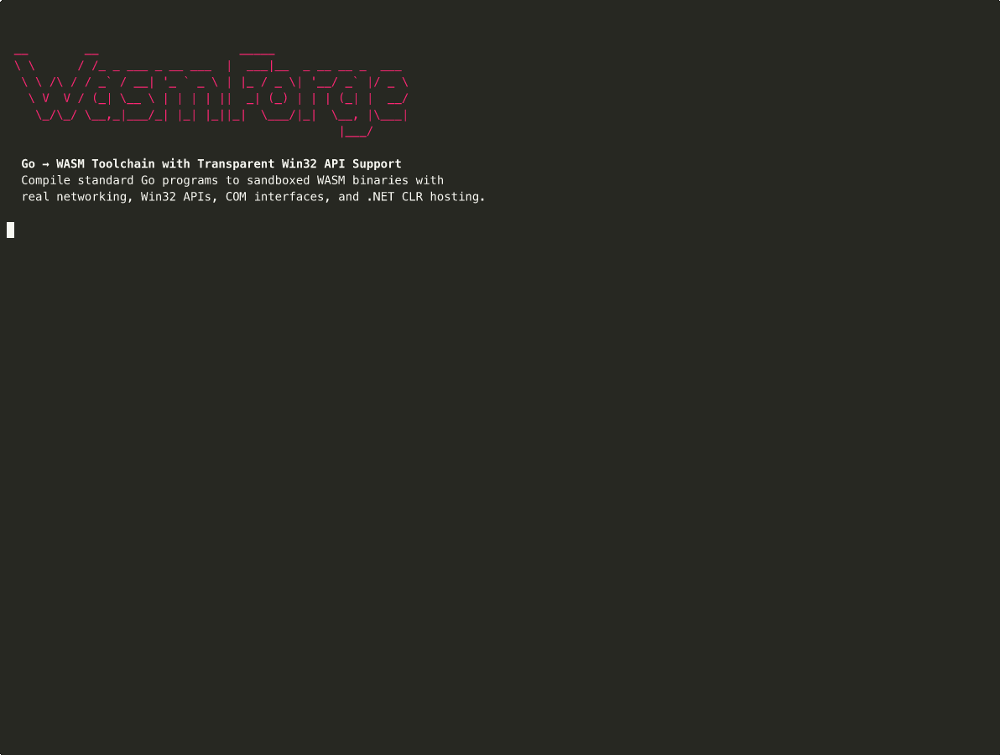

# WasmForge

WasmForge compiles Go and C# programs to WebAssembly, then packages them as single native binaries. The resulting executables sandbox guest code inside a WASM runtime (a per-build fork of [wazero](https://github.com/tetratelabs/wazero)). From inside that sandbox, guests get transparent access to networking, raw sockets, Win32 APIs, and macOS framework APIs.

You can write normal Go using `net.Dial`, `net.Listen`, or `net/http`. You can also migrate an existing .NET Framework C# project. Either way, the output is a single binary that runs on Windows or macOS, without requiring the user to make modifications to the guest source.



## I JUST WANT TO TALK TO A HUMAN

A quick glance at this project will make it fairly obvious that this was developed with some *HEAVY* usage of LLMs. A chunk of the documentation has been as well - but this section is not. I've done my best to de-slopify this README along with making the process for actually using WasmForge as straightforward as possible. Also while the LLMs will write documentation that heavily glazes its own accomplishments, the limitations aren't made QUITE as clear. 

To set expectations properly, while this has been tested with lots of different features for Go, it is NOT a complete solution for all Go programs. There's still a healthy % of the win32 API that is not properly supported (like APIs that require callback thunks). Sliver, for example, works for a healthy number of commands but it is NOT a full 1:1 port with functionality. `ls`, for example, will still show paths with `/`s instead of the traditional `C:\` pathing since the WASM blob isn't fully tricked into realizing its within Windows. There are other capabilities that will just trigger a crash. **Make sure you test any functionality you want to use before trying to use it on a real target.** If there's something that doesn't work, try to build out the most basic example of the API which is broken and open an issue / submit a PR.

The C# side of house is ultimately more proof-of-concept than implementation. The process that's used to compile C# to WASM is just *too* experimental and it means that WasmForge often needs to re-write a healthy amount of the program anyways to get it to run. Ultimately I probably rabbit holed too hard on this capability and should have just recommended people use an LLM to re-write C# code as Go code. It's probably less painful to deal with. That being said, the general pattern of C# -> Wasm -> WasmForge DOES work and it does break a healthy number of C#-specific detections.

On that note - WasmForge is primarily meant to deal with **STATIC** detections. The transpilation process breaks most detections, even for in-memory scanning, but ultimately if your binary has some very obvious strings like `mimikatz` or `sliver` in it there are some low-effort in-memory scans that will cause a detection. Automatic string obfuscation will likely be added in the future as it's a fairly easy feature to automate, but for the first pass I didn't want to add additional complexity to the build pipeline to keep debugging *relatively* straightforward.

While there has been some efforts to clean/consolidate the source code in this repository, it's still fairly disorganized. There's several different folders for different testing processes. Basic unit tests tend to live in `examples/` and `test/` while some of the more complex tests meant to be run in a full lab environment live in `testdata/`. There's also a number of development/testing only tools living in the `scripts/` and `internal/devtools` folders. These will only be necessary if you're trying to setup your own test environment to do further development. In general any LLM development of something this complicated requires a number of very explicit test cases to guide generation otherwise you end up with something that doesn't work at all. The project includes these harnesses so anyone curious can further their own development of tooling or contribute to the project.

Hopefully the community finds this tooling relatively easy to use and over time we'll continue to improve this. Maybe one day C# compilation will actually work as well as Go compilation. 

## Quick Start (Go projects)

There are three ways to get `wasmforge`:

1. **Prebuilt binary.** Grab a release from the
   [Releases page](https://github.com/praetorian-inc/wasmforge/releases) —
   Linux, macOS, and Windows builds of the CLI are attached to each tag.
2. **Docker image.** For C# / .NET projects, the bundled image ships every
   prerequisite (.NET 10 SDK, NativeAOT-LLVM workload, WASI SDK 24.0,
   `wasm-ld`, `osslsigncode`) preinstalled. Build it once with
   `make docker-build` and drive it with `make docker-run` — see
   [docs/CSHARP.md](docs/CSHARP.md) for the full workflow. This is the
   recommended path for C#.
3. **Build from source.**

   ```bash
   make build
   ```

   `make build` regenerates the embedded `internal/build/build_assets.tar.gz`
   and then compiles the CLI. If you just run `go build -o wasmforge
   ./cmd/wasmforge` you'll get a working binary, but distribution-mode builds
   (when the CLI runs outside this source tree) will use a stale embedded
   archive. See [CONTRIBUTING.md](CONTRIBUTING.md) for the longer explanation.

The `examples/` directory has runnable Go programs you can build right
away. See [examples/README.md](examples/README.md) for the full menu.

### Target Windows

```bash
GOOS=windows GOARCH=amd64 ./wasmforge build \
  --ghost traefik \
  -o myapp.exe \
  /path/to/your/project
```

The Win32 API bridge is auto-enabled whenever `GOOS=windows` — you no
longer need to pass `--win32-apis` for the common case.

`--ghost traefik` swaps the embedded `gopclntab` symbol distribution to look like the Traefik reverse proxy. Of the bundled profiles, this one produces the lowest VirusTotal detection rate. Other profiles and instructions for generating your own live in [docs/GHOST-PROFILES.md](docs/GHOST-PROFILES.md).

Windows targets are auto-signed with a self-signed certificate by default. Use `--sign google.com` to spoof a domain's TLS cert, or `--no-sign` to disable signing entirely.

### Target macOS

```bash
# Intel
GOOS=darwin GOARCH=amd64 ./wasmforge build -o myapp /path/to/your/project

# Apple Silicon
GOOS=darwin GOARCH=arm64 ./wasmforge build -o myapp /path/to/your/project
```

No extra flags are required. The macOS framework bridge auto-enables whenever `GOOS=darwin`. See [docs/MACOS.md](docs/MACOS.md) for the framework bridge, purego/ObjC support, and other Apple-specific notes.

### Optional flags

```bash
# Raw socket support (requires CAP_NET_RAW or root at build time)
./wasmforge build --raw-sockets -o myapp ./path/to/project

# Verbose output (useful for first builds)
GOOS=windows GOARCH=amd64 ./wasmforge build --ghost traefik --win32-apis -v -o tool.exe /path/to/project

# Custom PE VERSIONINFO (Windows only)
./wasmforge build --pe-company "Acme Corp" --pe-product "AcmeTool" --pe-file-version "10.0.19041.1" ...
```

### Compiling C# / .NET projects

C# projects (`.csproj` files) are auto-detected. WasmForge runs the full NativeAOT-WASI migration, patch, and build pipeline in one command:

```bash
GOOS=windows GOARCH=amd64 ./wasmforge build --win32-apis -o seatbelt.exe path/to/Seatbelt/Seatbelt/
```

For C# work we strongly recommend the Docker build environment. It bundles every prerequisite (.NET 10 SDK, NativeAOT-LLVM workload, WASI SDK 24.0, `wasm-ld`) so you do not need to install any of them on the host. Full instructions live in [docs/CSHARP.md](docs/CSHARP.md).

## CLI Summary

```
wasmforge build [package]      Compile Go (or C#) package to a WASM-sandboxed native binary
  -o, --output <path>          Output binary path
  --ghost <name>               Ghost profile: traefik, caddy, terraform (see docs/GHOST-PROFILES.md)
  --raw-sockets                Enable raw socket support
  --win32-apis                 Enable Win32 API bridge (Windows targets)
  --sign <mode>                Sign binary: 'self' or domain name (default: self for Windows)
  --no-sign                    Disable default auto-signing for Windows targets
  --tags <tags>                Go build tags (comma-separated)
  --pe-company / --pe-product / --pe-description / --pe-copyright / --pe-file-version
                               PE VERSIONINFO overrides
  -v, --verbose                Verbose build output

wasmforge run [package]        Build and immediately execute
wasmforge clean                Remove cached patched GOROOTs (~/.wasmforge/cache/)
wasmforge version              Print version

wasmforge dotnet-migrate <dir> Migrate .NET Framework project to .NET 10 NativeAOT-WASI
wasmforge dotnet-patch <dir>   Apply NativeAOT-WASI C# source patches
```

## Features

WasmForge bridges the gap between WASM and the underlying host so guest programs do not have to.

**Platform APIs.** TCP, UDP, DNS, HTTP, TLS, and raw sockets work without guest code changes on both Windows and macOS. On Windows, WasmForge proxies the full Win32 surface: registry, file I/O, processes, DLL loading, and `SyscallN` with up to 15 arguments. Pointer translation is automatic. COM vtable chains are mirrored so the CLR and other COM-heavy APIs work end-to-end. On macOS, `dlopen` and `dlsym` reach any framework (Security, CoreGraphics, IOKit, and so on), and `ebitengine/purego` plus the Objective-C runtime work out of the box.

**.NET hosting and migration.** The CLR loads through the standard chain (`CoInitializeEx`, `CLRCreateInstance`, `Load_3`, `Invoke_3`). AMSI is patched at startup so `Assembly.Load(byte[])` does not block known tooling. A separate NativeAOT-WASI pipeline takes existing .NET Framework projects and produces single Windows PE binaries with no .NET runtime required on the target.

**Host memory and shellcode.** A `VirtualAlloc`-backed host memory proxy is reachable from inside the guest. That makes COFF/BOF loaders and shellcode execution possible without escaping the WASM sandbox.

**Cooperative yield.** Blocking Win32 APIs (`Sleep`, `WaitForSingleObject`, `ReadFile`, and similar) do not freeze WASM goroutines. The host dispatches the call on a background goroutine and signals the guest to yield until the result is ready.

**Polymorphic output.** Every build produces a structurally unique binary. WASM opcodes are permuted, section IDs and magic bytes are randomized, and every identifier, PE import, VERSIONINFO string, license block, and source filename is scrubbed. The bundled wazero fork is rewritten to match the permuted bytecode. Ghost profiling rewrites `gopclntab` symbols to match real enterprise Go binaries (Traefik, Caddy, Terraform). Windows outputs are Authenticode-signed by default, either self-signed or spoofing a real domain's TLS certificate via `osslsigncode`.

## Architecture

```
+-------------------- WASM Guest (wasip1) --------------------+
|                                                             |
|  Your Go Program (net, net/http, os; works transparently)   |
|                                                             |
+----------- go:wasmimport ABI (custom opcodes) --------------+
                        |
+----------- Host Runtime (per-build wazero fork) ------------+
|                                                             |
|  90+ host functions (networking, OS proxies, platform APIs) |
|  Windows: pointer translation, shadow memory, COM mirroring |
|  macOS: dlopen/dlsym framework bridge, ABI trampolines      |
|                                                             |
+----------- wazero (custom VM: permuted opcodes/magic) ------+
                        |
         OS Kernel / Windows APIs / macOS Frameworks
```

The build pipeline runs in six stages.

1. **Prepare patched GOROOT.** Symlink Go's stdlib and patch `syscall/` and `net/` for WASM networking. Cached at `~/.wasmforge/cache/`.
2. **Compile Go to WASM.** Build with `GOOS=wasip1 GOARCH=wasm` against the patched stdlib. Auto-stubs cover platform-specific gaps. Sysshims for `golang.org/x/sys` and `ebitengine/purego` are injected when those imports are present.
3. **Remap WASM.** Per-build opcode permutation, section ID permutation, custom magic bytes, and a full-payload byte substitution.
4. **Generate host binary.** Polymorphic `main.go` with randomized identifiers, a matching per-build wazero fork, baked-in PE resources, and `-trimpath`.
5. **PE post-processing (Windows only).** Import enrichment, PE checksum, and payload injection as a named PE section.
6. **Code signing (optional).** Authenticode signing via `osslsigncode`.

## Real-World Validation

WasmForge compiles and runs unmodified third-party Go projects, including ones with complex platform-specific code.

| Program                                                          | Platform | Description                            | Validated                                                                      |
| ---------------------------------------------------------------- | -------- | -------------------------------------- | ------------------------------------------------------------------------------ |
| **Sliver**                                                       | Windows  | C2 framework, heavy Win32 usage        | HTTPS beacon, `whoami`, `ps`, `netstat`, `execute-assembly` (Rubeus, Seatbelt) |
| **Sliver**                                                       | macOS    | C2 framework (beacon + session)        | `pwd`, `ls`, `download`, `execute`, SOCKS5 proxy                               |
| **go-clr**                                                       | Windows  | .NET CLR hosting + assembly execution  | CLR load chain, Rubeus triage, Seatbelt system scan                            |
| **Chisel**                                                       | Windows  | TCP/UDP tunnel over HTTP with SOCKS5   | Tunnel connectivity, proxy forwarding                                          |
| **Ligolo-ng**                                                    | Windows  | Advanced tunneling and pivoting        | TUN interface, agent connectivity                                              |
| **[goffloader](https://github.com/praetorian-inc/goffloader)**   | Windows  | COFF/BOF loader using `unsafe.Pointer` | VirtualAlloc, shellcode exec, PE parsing, IAT resolution                       |

**.NET NativeAOT-WASI programs:**

| Program        | Platform | Description                | Validated                                                                                                              |
| -------------- | -------- | -------------------------- | ---------------------------------------------------------------------------------------------------------------------- |
| **Seatbelt**   | Windows  | Security enumeration       | Most commands pass; a handful that require WMI / Defender callback dispatch are honest-stubbed pending bridge support. |
| **Rubeus**     | Windows  | Kerberos tooling           | Hash + token operations work directly; network verbs (`asktgt`, `kerberoast`, `asreproast`) go through the TCP bridge; LSA queries (`klist`, `logonsession`) match native baselines. |

See [docs/BUILDING-SLIVER.md](docs/BUILDING-SLIVER.md) for a step-by-step Sliver walkthrough, and [docs/CSHARP.md](docs/CSHARP.md) for the C# pipeline.

## Requirements

WasmForge runs on Linux, macOS, or Windows build hosts. Go 1.25 or newer is required.

A few features need extra setup. Raw sockets need `CAP_NET_RAW` or root. The Win32 bridge needs a Windows target with `--win32-apis` (other targets return `ENOSYS`). The macOS framework bridge needs a macOS target and is auto-detected from `GOOS=darwin`. Code signing needs `osslsigncode` on the `PATH`. C# projects need the .NET 10 SDK, the NativeAOT-LLVM workload, and WASI SDK 24.0. Alternatively, the bundled Docker image (covered in [docs/CSHARP.md](docs/CSHARP.md)) ships with all of those preinstalled.

The parity test harness (`test/parity/`) and the lab-plant scripts under `scripts/lab-setup/` additionally assume an Active Directory range stood up with **[Ludus](https://gitlab.com/badsectorlabs/ludus)** running **[GOAD (Game of Active Directory)](https://github.com/Orange-Cyberdefense/GOAD)** — every hardcoded `sevenkingdoms.local` / `kingslanding` / `SEVENKINGDOMS-CA` default is a GOAD default, overridable via `WASMFORGE_PARITY_*` env vars (see `test/parity/internal/lab/lab.go`). See [docs/internals/PARITY-HARNESS.md](docs/internals/PARITY-HARNESS.md) and [docs/internals/LAB-STABILITY.md](docs/internals/LAB-STABILITY.md) for the full lab setup.

## Documentation

**Start here**

| Topic | Document |
| --- | --- |
| Runnable examples (TCP scanner, HTTP server, ICMP ping) | [examples/README.md](examples/README.md) |
| Building Sliver end-to-end (Windows + macOS) | [docs/BUILDING-SLIVER.md](docs/BUILDING-SLIVER.md) |
| C# / .NET project compilation (Docker workflow) | [docs/CSHARP.md](docs/CSHARP.md) |
| macOS targets and the framework bridge | [docs/MACOS.md](docs/MACOS.md) |
| Ghost profile usage and custom profile builds | [docs/GHOST-PROFILES.md](docs/GHOST-PROFILES.md) |
| Build-time environment variables (R80 recipe, every `WASMFORGE_*` knob) | [docs/ENVIRONMENT.md](docs/ENVIRONMENT.md) |

**Going deeper**

| Topic | Document |
| --- | --- |
| Architecture — host module, build pipeline, design decisions | [docs/ARCHITECTURE.md](docs/ARCHITECTURE.md) |
| Contributing — repo layout, prerequisites, adding host functions | [CONTRIBUTING.md](CONTRIBUTING.md) |
| Security policy + disclosure | [SECURITY.md](SECURITY.md) |
| Code of conduct | [CODE_OF_CONDUCT.md](CODE_OF_CONDUCT.md) |

**Maintainer references**

| Topic | Document |
| --- | --- |
| Host API contract — registered exports, signature stability | [docs/internals/HOST-API-CONTRACT.md](docs/internals/HOST-API-CONTRACT.md) |
| AST patcher internals — string-replace rules and dispatch | [docs/internals/AST-PATCHER.md](docs/internals/AST-PATCHER.md) |
| Parity harness — running C# native vs WASM diffs | [docs/internals/PARITY-HARNESS.md](docs/internals/PARITY-HARNESS.md) |
| Lab stability — Ludus + GOAD range setup, watchdog scripts | [docs/internals/LAB-STABILITY.md](docs/internals/LAB-STABILITY.md) |

## License

Licensed under the Apache License, Version 2.0. See [LICENSE](LICENSE) and
[NOTICE](NOTICE) for details.

Copyright (c) 2025-2026 Praetorian Security, Inc.
